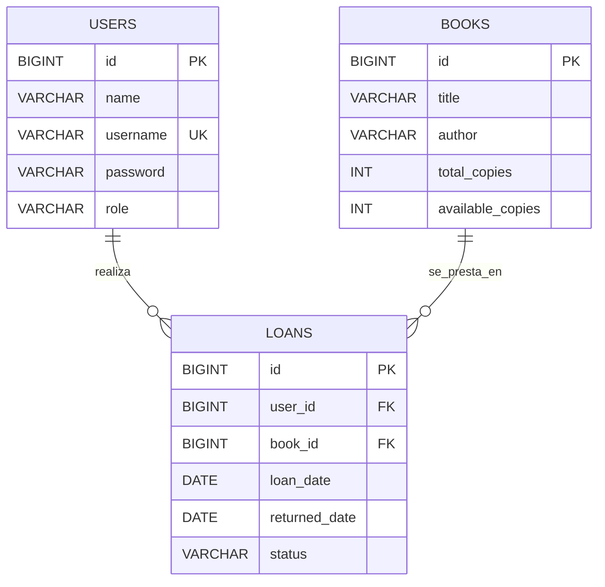

# DOSW-Library

## Diagramas

### Diagrama de clases


### Modelo entidad-relacion en 3FN

El modelo relacional queda normalizado en 3FN con tres entidades principales:

- `users`: almacena los datos del usuario y su rol.
- `books`: almacena la informacion del libro y su inventario.
- `loans`: relaciona usuarios y libros, y conserva el historico del prestamo.

No hay grupos repetidos, los atributos son atomicos, cada tabla depende de su clave primaria y no existen dependencias transitivas entre atributos no clave.



## Persistencia

La capa `persistence` ya fue implementada con Spring Data JPA.

### Entidades JPA

- `Book`: [Book.java](/C:/Users/juane/OneDrive/Escritorio/UNIVERSIDAD/Ciclos/Library/DOSW-Library/src/main/java/edu/eci/dosw/domain/model/Book.java)
- `LibraryUser`: [LibraryUser.java](/C:/Users/juane/OneDrive/Escritorio/UNIVERSIDAD/Ciclos/Library/DOSW-Library/src/main/java/edu/eci/dosw/domain/model/LibraryUser.java)
- `Loan`: [Loan.java](/C:/Users/juane/OneDrive/Escritorio/UNIVERSIDAD/Ciclos/Library/DOSW-Library/src/main/java/edu/eci/dosw/domain/model/Loan.java)

### Repositorios

- `BookRepository`: [BookRepository.java](/C:/Users/juane/OneDrive/Escritorio/UNIVERSIDAD/Ciclos/Library/DOSW-Library/src/main/java/edu/eci/dosw/infrastructure/persistence/BookRepository.java)
- `UserRepository`: [UserRepository.java](/C:/Users/juane/OneDrive/Escritorio/UNIVERSIDAD/Ciclos/Library/DOSW-Library/src/main/java/edu/eci/dosw/infrastructure/persistence/UserRepository.java)
- `LoanRepository`: [LoanRepository.java](/C:/Users/juane/OneDrive/Escritorio/UNIVERSIDAD/Ciclos/Library/DOSW-Library/src/main/java/edu/eci/dosw/infrastructure/persistence/LoanRepository.java)

Consultas relevantes:

- `BookRepository.findByAvailableCopiesGreaterThan`
- `UserRepository.findByUsername`
- `UserRepository.existsByUsername`
- `LoanRepository.countByUserAndStatus`
- `LoanRepository.findByUserOrderByLoanDateDesc`

### Configuracion JPA

La dependencia `spring-boot-starter-data-jpa` ya se encuentra en [pom.xml](/C:/Users/juane/OneDrive/Escritorio/UNIVERSIDAD/Ciclos/Library/DOSW-Library/pom.xml) y la aplicacion habilita repositorios JPA desde [DoswLibraryApplication.java](/C:/Users/juane/OneDrive/Escritorio/UNIVERSIDAD/Ciclos/Library/DOSW-Library/src/main/java/edu/eci/dosw/DoswLibraryApplication.java).

## Seguridad

La API implementa autenticacion y autorizacion stateless con JWT.

### Autenticacion

- Login publico en `POST /api/auth/login`
- Generacion y validacion del token en [JwtService.java](/C:/Users/juane/OneDrive/Escritorio/UNIVERSIDAD/Ciclos/Library/DOSW-Library/src/main/java/edu/eci/dosw/infrastructure/security/JwtService.java)
- Filtro JWT en [JwtAuthenticationFilter.java](/C:/Users/juane/OneDrive/Escritorio/UNIVERSIDAD/Ciclos/Library/DOSW-Library/src/main/java/edu/eci/dosw/infrastructure/security/JwtAuthenticationFilter.java)
- Configuracion stateless en [SecurityConfig.java](/C:/Users/juane/OneDrive/Escritorio/UNIVERSIDAD/Ciclos/Library/DOSW-Library/src/main/java/edu/eci/dosw/infrastructure/security/SecurityConfig.java)

El token incluye:

- `userId`
- `role`
- expiracion `TTL`
- firma digital

### Autorizacion por rol

- `LIBRARIAN` puede gestionar libros, inventario, usuarios y consultar todos los prestamos.
- `USER` puede solicitar prestamos, devolver libros, consultar libros y consultar solo sus propios prestamos.

### CORS

Se configuro CORS de forma global en [SecurityConfig.java](/C:/Users/juane/OneDrive/Escritorio/UNIVERSIDAD/Ciclos/Library/DOSW-Library/src/main/java/edu/eci/dosw/infrastructure/security/SecurityConfig.java) con origenes permitidos configurables desde [application.yaml](/C:/Users/juane/OneDrive/Escritorio/UNIVERSIDAD/Ciclos/Library/DOSW-Library/src/main/resources/application.yaml).

Variable soportada:

- `CORS_ALLOWED_ORIGIN_PATTERN`

### HTTPS

La aplicacion queda preparada para HTTPS mediante configuracion SSL/TLS en [application.yaml](/C:/Users/juane/OneDrive/Escritorio/UNIVERSIDAD/Ciclos/Library/DOSW-Library/src/main/resources/application.yaml).

Variables soportadas:

- `SERVER_SSL_ENABLED`
- `SERVER_SSL_KEY_STORE`
- `SERVER_SSL_KEY_STORE_PASSWORD`
- `SERVER_SSL_KEY_STORE_TYPE`
- `SERVER_SSL_KEY_ALIAS`

## Evidencia de pruebas

Se validaron operaciones funcionales y de seguridad con pruebas de integracion sobre base de datos de prueba.

Escenarios cubiertos:

- acceso sin token
- acceso con token invalido
- acceso con rol incorrecto
- acceso con permisos correctos
- login exitoso
- login con credenciales invalidas
- creacion y actualizacion de libros
- prestamos y devoluciones
- alta de usuarios por bibliotecario

Ultima verificacion automatizada:

```text
.\mvnw.cmd test
Tests run: 37, Failures: 0, Errors: 0, Skipped: 0
```

## Video de demostracion

Agregar aqui el enlace al video solicitado con la demostracion de:

- proceso de login
- obtencion del JWT
- uso del token en requests
- acceso permitido y denegado segun rol

Enlace del video:

`PENDIENTE_AGREGAR_ENLACE`
