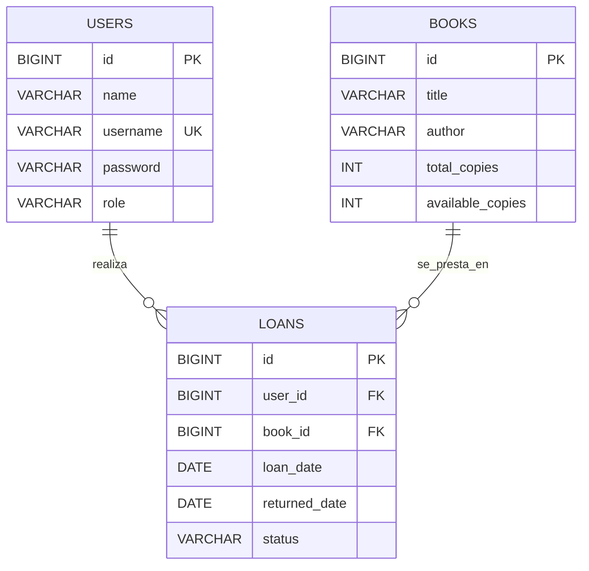

# DOSW-Library

## Diagramas

### Diagrama de clases


### Modelo entidad-relacion en 3FN

El modelo relacional queda normalizado en 3FN con tres entidades principales:

- `users`: almacena los datos del usuario y su rol.
- `books`: almacena la informacion del libro y su inventario.
- `loans`: relaciona usuarios y libros, y conserva el historico del prestamo.

No hay grupos repetidos, los atributos son atomicos, cada tabla depende de su clave primaria y no existen dependencias transitivas entre atributos no clave.



## Persistencia

La capa `persistence` ya fue implementada con Spring Data JPA.

### Persistencia Hibrida

El sistema ahora trabaja en dos mundos al mismo tiempo:

- PostgreSQL sigue siendo la fuente principal de verdad.
- MongoDB Atlas funciona como persistencia secundaria y flexible para proyecciones sincronizadas.

Mongo se habilita solo si `MONGODB_ENABLED=true`. Cuando esta activo, cada escritura exitosa en PostgreSQL replica el agregado correspondiente en MongoDB.

### Entidades JPA

- `Book`: [Book.java](/C:/Users/juane/OneDrive/Escritorio/UNIVERSIDAD/Ciclos/Library/DOSW-Library/src/main/java/edu/eci/dosw/domain/model/Book.java)
- `LibraryUser`: [LibraryUser.java](/C:/Users/juane/OneDrive/Escritorio/UNIVERSIDAD/Ciclos/Library/DOSW-Library/src/main/java/edu/eci/dosw/domain/model/LibraryUser.java)
- `Loan`: [Loan.java](/C:/Users/juane/OneDrive/Escritorio/UNIVERSIDAD/Ciclos/Library/DOSW-Library/src/main/java/edu/eci/dosw/domain/model/Loan.java)

### Repositorios

- `BookRepository`: [BookRepository.java](/C:/Users/juane/OneDrive/Escritorio/UNIVERSIDAD/Ciclos/Library/DOSW-Library/src/main/java/edu/eci/dosw/infrastructure/persistence/BookRepository.java)
- `UserRepository`: [UserRepository.java](/C:/Users/juane/OneDrive/Escritorio/UNIVERSIDAD/Ciclos/Library/DOSW-Library/src/main/java/edu/eci/dosw/infrastructure/persistence/UserRepository.java)
- `LoanRepository`: [LoanRepository.java](/C:/Users/juane/OneDrive/Escritorio/UNIVERSIDAD/Ciclos/Library/DOSW-Library/src/main/java/edu/eci/dosw/infrastructure/persistence/LoanRepository.java)

Consultas relevantes:

- `BookRepository.findByAvailableCopiesGreaterThan`
- `UserRepository.findByUsername`
- `UserRepository.existsByUsername`
- `LoanRepository.countByUserAndStatus`
- `LoanRepository.findByUserOrderByLoanDateDesc`

### Configuracion JPA

La dependencia `spring-boot-starter-data-jpa` ya se encuentra en [pom.xml](/C:/Users/juane/OneDrive/Escritorio/UNIVERSIDAD/Ciclos/Library/DOSW-Library/pom.xml) y la aplicacion habilita repositorios JPA desde [DoswLibraryApplication.java](/C:/Users/juane/OneDrive/Escritorio/UNIVERSIDAD/Ciclos/Library/DOSW-Library/src/main/java/edu/eci/dosw/DoswLibraryApplication.java).

### MongoDB Atlas

Se agrego soporte para MongoDB mediante:

- configuracion condicional en [MongoPersistenceConfig.java](/C:/Users/juane/OneDrive/Escritorio/UNIVERSIDAD/Ciclos/Library/DOSW-Library/src/main/java/edu/eci/dosw/infrastructure/mongodb/MongoPersistenceConfig.java)
- sincronizacion secundaria en [DualPersistenceSyncService.java](/C:/Users/juane/OneDrive/Escritorio/UNIVERSIDAD/Ciclos/Library/DOSW-Library/src/main/java/edu/eci/dosw/infrastructure/mongodb/DualPersistenceSyncService.java)
- documentos Mongo en [MongoBookDocument.java](/C:/Users/juane/OneDrive/Escritorio/UNIVERSIDAD/Ciclos/Library/DOSW-Library/src/main/java/edu/eci/dosw/infrastructure/mongodb/document/MongoBookDocument.java), [MongoUserDocument.java](/C:/Users/juane/OneDrive/Escritorio/UNIVERSIDAD/Ciclos/Library/DOSW-Library/src/main/java/edu/eci/dosw/infrastructure/mongodb/document/MongoUserDocument.java) y [MongoLoanDocument.java](/C:/Users/juane/OneDrive/Escritorio/UNIVERSIDAD/Ciclos/Library/DOSW-Library/src/main/java/edu/eci/dosw/infrastructure/mongodb/document/MongoLoanDocument.java)

Variables de entorno soportadas:

- `MONGODB_ENABLED`
- `MONGODB_URI`
- `MONGODB_DATABASE`
- `MONGODB_WRITE_MODE`

## Seguridad

La API implementa autenticacion y autorizacion stateless con JWT.

### Autenticacion

- Login publico en `POST /api/auth/login`
- Generacion y validacion del token en [JwtService.java](/C:/Users/juane/OneDrive/Escritorio/UNIVERSIDAD/Ciclos/Library/DOSW-Library/src/main/java/edu/eci/dosw/infrastructure/security/JwtService.java)
- Filtro JWT en [JwtAuthenticationFilter.java](/C:/Users/juane/OneDrive/Escritorio/UNIVERSIDAD/Ciclos/Library/DOSW-Library/src/main/java/edu/eci/dosw/infrastructure/security/JwtAuthenticationFilter.java)
- Configuracion stateless en [SecurityConfig.java](/C:/Users/juane/OneDrive/Escritorio/UNIVERSIDAD/Ciclos/Library/DOSW-Library/src/main/java/edu/eci/dosw/infrastructure/security/SecurityConfig.java)

El token incluye:

- `userId`
- `role`
- expiracion `TTL`
- firma digital

### Autorizacion por rol

- `LIBRARIAN` puede gestionar libros, inventario, usuarios y consultar todos los prestamos.
- `USER` puede solicitar prestamos, devolver libros, consultar libros y consultar solo sus propios prestamos.

### CORS

Se configuro CORS de forma global en [SecurityConfig.java](/C:/Users/juane/OneDrive/Escritorio/UNIVERSIDAD/Ciclos/Library/DOSW-Library/src/main/java/edu/eci/dosw/infrastructure/security/SecurityConfig.java) con origenes permitidos configurables desde [application.yaml](/C:/Users/juane/OneDrive/Escritorio/UNIVERSIDAD/Ciclos/Library/DOSW-Library/src/main/resources/application.yaml).

Variable soportada:

- `CORS_ALLOWED_ORIGIN_PATTERN`

### HTTPS

La aplicacion queda preparada para HTTPS mediante configuracion SSL/TLS en [application.yaml](/C:/Users/juane/OneDrive/Escritorio/UNIVERSIDAD/Ciclos/Library/DOSW-Library/src/main/resources/application.yaml).

Variables soportadas:

- `SERVER_SSL_ENABLED`
- `SERVER_SSL_KEY_STORE`
- `SERVER_SSL_KEY_STORE_PASSWORD`
- `SERVER_SSL_KEY_STORE_TYPE`
- `SERVER_SSL_KEY_ALIAS`

## Evidencia de pruebas

Se validaron operaciones funcionales y de seguridad con pruebas de integracion sobre base de datos de prueba.

Escenarios cubiertos:

- acceso sin token
- acceso con token invalido
- acceso con rol incorrecto
- acceso con permisos correctos
- login exitoso
- login con credenciales invalidas
- creacion y actualizacion de libros
- prestamos y devoluciones
- alta de usuarios por bibliotecario

Ultima verificacion automatizada:

```text
.\mvnw.cmd test
Tests run: 37, Failures: 0, Errors: 0, Skipped: 0
```

## Despliegue En Azure

El proyecto queda preparado para despliegue en Azure App Service usando contenedor Docker.

Artefactos agregados:

- [Dockerfile](/C:/Users/juane/OneDrive/Escritorio/UNIVERSIDAD/Ciclos/Library/DOSW-Library/Dockerfile)
- [.dockerignore](/C:/Users/juane/OneDrive/Escritorio/UNIVERSIDAD/Ciclos/Library/DOSW-Library/.dockerignore)
- [ci-cd.yml](/C:/Users/juane/OneDrive/Escritorio/UNIVERSIDAD/Ciclos/Library/DOSW-Library/.github/workflows/ci-cd.yml)

## CI-CD

Se implemento un pipeline completo con GitHub Actions en [ci-cd.yml](/C:/Users/juane/OneDrive/Escritorio/UNIVERSIDAD/Ciclos/Library/DOSW-Library/.github/workflows/ci-cd.yml).

Flujo automatizado:

- construccion del proyecto
- ejecucion de pruebas con `mvn clean verify`
- analisis estatico con Sonar
- construccion de imagen Docker
- publicacion en Azure Container Registry
- despliegue automatico al entorno productivo en Azure Web App

Triggers:

- `pull_request` hacia `main`: build, pruebas y analisis estatico
- `push` a `develop`: build, pruebas y analisis estatico
- `push` a `main`: build, pruebas, analisis, construccion de imagen y despliegue a produccion
- `workflow_dispatch`: ejecucion manual

Secrets esperados por el pipeline:

- `AZURE_CREDENTIALS`
- `AZURE_WEBAPP_NAME`
- `ACR_LOGIN_SERVER`
- `ACR_USERNAME`
- `ACR_PASSWORD`
- `SONAR_TOKEN`

Variables de entorno minimas a configurar en Azure:

- `DB_HOST`
- `DB_PORT`
- `DB_NAME`
- `DB_USERNAME`
- `DB_PASSWORD`
- `MONGODB_ENABLED`
- `MONGODB_URI`
- `MONGODB_DATABASE`
- `SERVER_SSL_ENABLED`
- `SERVER_SSL_KEY_STORE`
- `SERVER_SSL_KEY_STORE_PASSWORD`
- `SERVER_SSL_KEY_STORE_TYPE`
- `SERVER_SSL_KEY_ALIAS`

Estado actual:

- el codigo ya esta preparado para persistencia dual, CI/CD y despliegue en Azure
- el despliegue real no se ejecuto desde este entorno porque hacen falta credenciales de Azure, ACR y MongoDB Atlas

## Video de demostracion

Agregar aqui el enlace al video solicitado con la demostracion de:

- proceso de login
- obtencion del JWT
- uso del token en requests
- acceso permitido y denegado segun rol

Enlace del video:

`PENDIENTE_AGREGAR_ENLACE`
